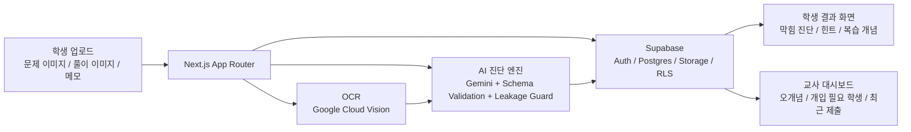

# StepHint

<p align="left">
  
  
  
  
  
</p>

StepHint는 학생의 풀이 과정을 읽고 막힌 지점을 진단한 뒤, 정답 대신 다음 한 단계 힌트만 제공하는 AI 기반 풀이형 학습 코치입니다.  
학생에게는 "어디에서 왜 막혔는지"를 설명 가능한 힌트로 돌려주고, 교사에게는 반복 오개념과 개입 우선순위를 빠르게 파악할 수 있는 인사이트를 제공합니다.

## 프로젝트 개요

기존의 정오답 중심 학습 도구는 결과는 보여줄 수 있어도, 학생이 풀이 과정에서 어디서 사고가 멈췄는지까지 설명해 주기는 어렵습니다.  
StepHint는 문제 이미지, 풀이 이미지, OCR 텍스트, 학생 메모를 함께 해석해 막힌 지점을 진단하고, 학생과 교사 모두가 활용할 수 있는 학습 피드백으로 연결하는 것을 목표로 합니다.

핵심 방향은 명확합니다.

- AI를 정답 생성기가 아니라 풀이 과정 진단 도구로 제한적으로 사용합니다.
- 학생에게는 정답 대신 다음 한 단계 힌트만 제공합니다.
- 교사에게는 연결된 학생 기준의 오개념, 복습 개념, 개입 필요 신호를 제공합니다.
- 권한, 데이터 접근, 이미지 저장은 교육 서비스 맥락에 맞게 역할 기반으로 분리합니다.

## 배포 정보

| 항목 | 내용 |
| --- | --- |
| 서비스 URL | [https://stephint.vercel.app/](https://stephint.vercel.app/) |
| 저장소 | [https://github.com/yeonjeyeong/stephint](https://github.com/yeonjeyeong/stephint) |
| 주요 사용자 | 학생, 교사, 관리자 교사 |
| 핵심 가치 | 정답 제공이 아닌 막힘 진단과 다음 단계 유도 |

## 핵심 기능

### 학생용 기능

- 문제 이미지, 풀이 이미지, 메모를 업로드하면 OCR과 Gemini가 함께 풀이를 해석합니다.
- 정답 노출 없이 막힌 지점, 오개념 태그, 복습 개념, 다음 한 단계 힌트를 제공합니다.
- 추가 힌트는 2단계까지만 열리며, fallback 사용 여부도 UI와 API에서 숨기지 않습니다.
- 학생은 누적 기록을 통해 어떤 유형에서 반복적으로 막히는지 스스로 점검할 수 있습니다.

### 교사용 기능

- 연결된 학생만 대시보드에 노출되어 불필요한 데이터 접근을 줄입니다.
- 반복 오개념, 복습 개념, 최근 제출 이미지, 개입 필요 학생을 한 화면에서 확인할 수 있습니다.
- 학생 상세 화면에서 최근 풀이 흐름과 교사 추천 액션을 함께 확인할 수 있습니다.
- 승인 기반 교사 권한 구조로 운영 흐름을 통제할 수 있습니다.

## 시스템 구성도



## 기술 스택

| 영역 | 스택 |
| --- | --- |
| Frontend | Next.js App Router, React 19, Tailwind CSS 4 |
| Backend | Next.js Route Handlers |
| AI | Gemini, Zod schema validation, answer leakage guard |
| OCR | Google Cloud Vision |
| Auth / DB / Storage | Supabase Auth, Postgres, Storage, RLS |
| 차트 / 시각화 | Recharts |
| 언어 | TypeScript |

기본 AI 설정은 `AI_PROVIDER=gemini`입니다.  
Gemini 또는 Vision 호출이 실패하면 fallback 결과를 반환하며, 이 상태는 UI와 API 응답에 명시됩니다.

## 프로젝트 구조

```text
stephint/
├─ public/                     # 정적 에셋
├─ scripts/                    # 로컬 점검 및 보조 스크립트
├─ src/
│  ├─ app/
│  │  ├─ api/                  # 분석, 인증, 힌트, 제출 기록, 교사 API
│  │  ├─ access-denied/        # 접근 제한 화면
│  │  ├─ features/             # 랜딩 페이지용 소개 섹션
│  │  ├─ forgot-password/      # 비밀번호 재설정 요청
│  │  ├─ login/                # 로그인 화면
│  │  ├─ reset-password/       # 비밀번호 재설정 화면
│  │  ├─ signup/               # 회원가입 화면
│  │  ├─ student/              # 학생 업로드, 결과, 기록 화면
│  │  ├─ teacher/              # 교사 대시보드, 학생 상세, 승인 대기 화면
│  │  ├─ globals.css           # 전역 스타일
│  │  ├─ layout.tsx            # 앱 공통 레이아웃
│  │  └─ page.tsx              # 메인 랜딩 페이지
│  ├─ components/
│  │  ├─ auth/                 # 권한 보호 컴포넌트
│  │  └─ layout/               # 헤더, 푸터 등 공통 UI
│  ├─ context/                 # 역할 및 세션 컨텍스트
│  ├─ lib/
│  │  ├─ ai/                   # 진단, 힌트 생성, provider, schema, guard
│  │  ├─ auth/                 # 세션, 접근 제어, rate limit 타입
│  │  ├─ db/                   # Supabase / Postgres 접근 계층
│  │  ├─ ocr/                  # Vision OCR 로직
│  │  └─ storage/              # 제출 이미지 저장 로직
│  ├─ seed/                    # mock 데이터
│  ├─ types/                   # 도메인 타입 정의
│  └─ proxy.ts                 # 경로 보호 및 역할 기반 리다이렉트
├─ supabase/
│  ├─ schema.sql               # DB 스키마
│  └─ seed.sql                 # 시연용 초기 데이터
├─ .env.example                # 환경 변수 예시
├─ next.config.ts              # Next.js 설정
└─ package.json                # 의존성 및 실행 스크립트
```

## 실행 방법

### 1. 의존성 설치

```bash
npm install
```

### 2. 환경 변수 설정

`.env.example`를 참고해 `.env.local`을 구성합니다.

```env
AI_PROVIDER=gemini
GEMINI_API_KEY=
GOOGLE_CLOUD_VISION_API_KEY=
NEXT_PUBLIC_SUPABASE_URL=
NEXT_PUBLIC_SUPABASE_ANON_KEY=
SUPABASE_SERVICE_ROLE_KEY=
POSTGRES_CONNECTION_STRING=
NEXT_PUBLIC_APP_NAME=StepHint
```

### 3. 데이터베이스 준비

- `supabase/schema.sql`로 스키마를 구성합니다.
- `supabase/seed.sql`로 시연용 계정과 기본 데이터를 넣습니다.

### 4. 로컬 서버 실행

```bash
npm run dev
```

기본 개발 서버는 `http://localhost:3000`에서 실행됩니다.

## 권한 및 보안 구조

- 학생과 교사 기능은 역할 기반으로 분리되어 있습니다.
- 교사 기능은 관리자 승인 이후 활성화되도록 설계되어 있습니다.
- 승인되지 않은 교사 계정은 교사 전용 기능에 접근할 수 없으며 승인 대기 화면으로 이동합니다.
- 교사 대시보드는 연결된 학생 데이터만 조회할 수 있습니다.
- 업로드 이미지는 비공개 Storage에 저장되며, 응답 시 signed URL로 변환해 제공합니다.

## 저장 구조

- 업로드 이미지는 Supabase Storage `submission-images` 버킷에 저장됩니다.
- 경로 규칙은 아래와 같습니다.
  - `userId/submissionId/problem.ext`
  - `userId/submissionId/solution.ext`
- DB의 `problem_image_url`, `solution_image_url` 컬럼에는 storage path를 저장하고, API 응답 시 signed URL로 변환합니다.

## 공식 데모 계정

시연은 아래 계정을 기준으로 진행하는 것을 권장합니다.  
필요한 경우 학생 계정과 교사 계정을 추가하여 시나리오를 확장할 수 있습니다.  
단, 추가 교사 계정은 관리자 교사의 승인을 거쳐야 교사 전용 기능을 사용할 수 있습니다.

### 학생 1

- 이메일: `student.one@example.com`
- 비밀번호: `Student!123`
- 닉네임: `student.one`

### 학생 2

- 이메일: `student.two@example.com`
- 비밀번호: `Student!234`
- 닉네임: `student.two`

### 관리자 교사

- 이메일: `teacher.one@example.com`
- 비밀번호: `Teacher!123`
- 닉네임: `teacher.one`

## 권장 시연 순서

1. 학생 계정으로 로그인합니다.
2. 문제 이미지와 풀이 이미지를 업로드해 진단 결과 화면을 보여줍니다.
3. OCR 토글, 진단 메타데이터 배지, 추가 힌트를 확인합니다.
4. 관리자 교사 계정으로 로그인합니다.
5. 교사 대시보드에서 요약 문구, 개입 필요 학생, 최근 제출 이미지를 보여줍니다.
6. 학생 상세 화면에서 교사 추천 액션과 반복 오개념을 설명합니다.
7. 필요하다면 추가 교사 계정을 생성한 뒤 승인 대기부터 관리자 승인까지의 권한 흐름을 시연합니다.

## 라이선스

이 프로젝트는 2026 KIT 바이브코딩 공모전 출품작입니다.
